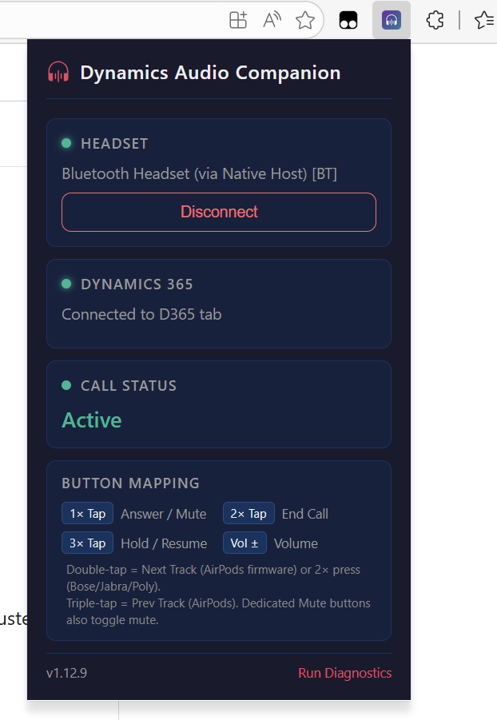

# Dynamics Audio Companion

A browser extension (Chrome/Edge) that connects **Bluetooth headsets** (Bose, Jabra, Poly, Yealink, AirPods, etc.) to **Dynamics 365 Contact Center**, enabling agents to accept, reject, hold, mute, and end calls using physical headset buttons.



## Table of Contents

- [Why This Exists](#why-this-exists)
- [Supported Hardware](#supported-hardware)
- [Button Mapping](#button-mapping)
  - [USB Mode (WebHID)](#usb-mode-webhid)
  - [Bluetooth Mode (Native Host)](#bluetooth-mode-native-host)
- [Architecture](#architecture)
- [Installation](#installation)
  - [Option A: Download a Release (recommended)](#option-a-download-a-release-recommended)
  - [Option B: Install from Source](#option-b-install-from-source)
  - [What the installer does](#what-the-installer-does)
  - [Sharing with coworkers](#sharing-with-coworkers)
  - [About the Setup .exe file](#about-the-setup-exe-file)
  - [Antivirus / Windows SmartScreen warnings](#antivirus--windows-smartscreen-warnings)
  - [How it works: USB vs Bluetooth](#how-it-works-usb-vs-bluetooth)
  - [Connect Your Headset](#connect-your-headset)
- [Testing & Diagnostics](#testing--diagnostics)
- [File Structure](#file-structure)
- [Browser Support](#browser-support)
- [Troubleshooting](#troubleshooting)
- [D365 Omnichannel Compatibility](#d365-omnichannel-compatibility)
- [Security](#security)
- [License](#license)

## Why This Exists

D365 Contact Center does **not natively support** headset call control. This extension bridges the gap using two approaches:

- **USB mode** — WebHID API communicates directly with USB-connected headsets (Bose, Jabra, Poly, Yealink)
- **Bluetooth mode** — A lightweight Native Messaging Host captures media key events from Bluetooth-connected headsets (e.g., Bose 700 HP) and relays them to the extension

## Supported Hardware

| Brand | Device | Connection | Mode | Supported |
|-------|--------|-----------|------|-----------|
| **Bose** | 700 HP | Bluetooth | Native Host | ✅ |
| **Bose** | 700 UC | USB / Bose USB Link dongle | WebHID | ✅ |
| **Bose** | QuietComfort 45 UC | USB-C / USB Link | WebHID | ✅ |
| **Bose** | QuietComfort Ultra UC | USB-C / USB Link 2 | WebHID | ✅ |
| **Bose** | USB Link / USB Link 2 | USB | WebHID | ✅ |
| **Jabra** | Evolve2 85 / 75 / 65 / 55 / 40 / 30 | USB / USB dongle | WebHID | ✅ |
| **Jabra** | Engage 50 / 50 II | USB | WebHID | ✅ |
| **Jabra** | Link 380 / 400 (BT dongle) | USB | WebHID | ✅ |
| **Jabra** | Any Bluetooth model | Bluetooth | Native Host | ✅ |
| **Poly** | Voyager Focus 2 | USB / BT700 dongle | WebHID | ✅ |
| **Poly** | Voyager 4320 / 4310 | USB / BT700 dongle | WebHID | ✅ |
| **Poly** | Blackwire 5220 / 3320 | USB | WebHID | ✅ |
| **Poly** | Savi 8200 series | USB | WebHID | ✅ |
| **Poly** | Calisto 5300 | USB | WebHID | ✅ |
| **Poly** | BT600 / BT700 (BT dongle) | USB | WebHID | ✅ |
| **Poly** | Any Bluetooth model | Bluetooth | Native Host | ✅ |
| **Yealink** | BH72 / BH76 / BH71 | USB / BHT60 dongle | WebHID | ✅ |
| **Yealink** | UH34 / UH36 / UH37 | USB | WebHID | ✅ |
| **Yealink** | WH62 / WH66 | USB / DECT dongle | WebHID | ✅ |
| **Yealink** | BHT60 (BT dongle) | USB | WebHID | ✅ |
| **Yealink** | Any Bluetooth model | Bluetooth | Native Host | ✅ |
| **Apple** | AirPods / AirPods Pro | Bluetooth | Native Host | ✅ |
| Other | Any Bluetooth headset | Bluetooth | Native Host | ⚠️ May work |
| Other | Any USB HID telephony headset | USB | WebHID | ⚠️ May work |

> **Bluetooth headsets:** Windows translates AVRCP button presses into global media key events. The Native Messaging Host captures these and maps them to D365 call actions. This works with any Bluetooth headset that supports standard media controls.

> **USB headsets:** Professional headsets from Bose, Jabra, Poly/Plantronics, and Yealink all use the standard USB HID Telephony usage page (0x0B). The same button parsing code works across all brands.

## Button Mapping

### USB Mode (WebHID)

| Headset Button | D365 Action |
|---------------|-------------|
| **Hook Switch** (answer button) | Accept incoming call / End active call |
| **Phone Mute** | Toggle microphone mute |
| **Flash** | Hold / Resume call |
| **Drop** | End call |
| **Volume Up/Down** | Adjust call volume |
| **Redial** | Redial last number |

### Bluetooth Mode (Native Host)

| Headset Button | Media Key | D365 Action |
|---------------|-----------|-------------|
| **Multi-function** (single press) | Play/Pause | Accept incoming call / End active call |
| **Multi-function** (long press) | Stop | Reject incoming call / End call |
| **Next Track** (if supported) | Next | Hold / Resume call |
| **Volume Mute** | Mute | Toggle microphone mute |
| **Volume Up/Down** | Volume | Adjust volume |

> **Note (Bluetooth):** Media key actions only intercept when a D365 call is active or ringing. During idle state, keys pass through to media players normally.

## Architecture

```
                         ┌───────────────────────────────┐
                         │       Service Worker          │
                         │     (Background Router)       │
                         │                               │
                         │  Manages state, routes msgs   │
                         └───┬───────┬──────────┬────────┘
                             │       │          │
              ┌──────────────┘       │          └──────────────┐
              ▼                      ▼                         ▼
┌──────────────────────┐  ┌──────────────────┐  ┌──────────────────────┐
│   Offscreen Doc      │  │  Native Host     │  │   Content Script     │
│   (WebHID — USB)     │  │  (Node.js —BT)   │  │   (D365 page)       │
│                      │  │                  │  │                      │
│  USB HID Telephony   │  │  Media Key       │  │   MutationObserver   │
│  Reports ↔ Bose      │  │  Listener        │  │   + CIF + DOM click  │
│  headset via USB     │  │  (stdio pipe)    │  │                      │
└──────────────────────┘  └──────────────────┘  └──────────────────────┘
```

**Flow: Headset button → D365 action:**
1. Bose headset sends HID input report → WebHID (offscreen document)
2. Offscreen parses button → sends `chrome.runtime` message to service worker
3. Service worker maps button to call action → routes to D365 tab's content script
4. Content script → `window.postMessage` → page-injected script
5. Page script clicks the appropriate D365 Omnichannel UI button (or uses CIF API)

**Flow: D365 state → Headset LEDs:**
1. Content script monitors D365 DOM for call state changes (MutationObserver)
2. State change → `chrome.runtime` message to service worker
3. Service worker → offscreen document
4. Offscreen sends HID output report → headset LEDs update (ring, mute, hold indicators)

## Installation

### Option A: Download a Release (recommended)

1. Go to the [**Releases** page](https://github.com/moliveirapinto/dynamics-audio-companion/releases)
2. Download the latest **DynamicsAudioCompanion-v*.zip** file (NOT "Source code")
3. Extract it to a permanent folder (e.g. `C:\DynamicsAudioCompanion`)
4. Double-click **`install.bat`**
5. Follow the on-screen instructions

> **No Node.js required.** The release package includes everything needed.

### Option B: Install from Source

1. Download or clone the repository
2. Double-click **`install.bat`**
3. The installer will automatically download any missing components (`node.exe` and dependencies) from trusted sources
4. Follow the on-screen instructions

### What the installer does

The installer (`install.bat`) handles everything automatically:

1. **Downloads `node.exe`** (if missing) — the official Node.js binary, digitally signed by the OpenJS Foundation. This is NOT installed system-wide; it lives only inside the extension folder
2. **Downloads dependencies** (if missing) — the `node_modules` folder is fetched from the latest GitHub release
3. **Prompts you to load the extension** in Edge/Chrome via Developer mode and asks for the Extension ID
4. **Registers the native messaging host** in the Windows registry (current user only, HKCU)

### Sharing with coworkers

After one person installs, they can copy the entire folder to a coworker. The coworker just needs to:

1. Copy the folder to their machine
2. Double-click **`install.bat`**
3. Load the extension and paste their own Extension ID

Since `node.exe` and all dependencies are already in the folder, no downloads are needed — it runs instantly.

> **Why does each person need to run `install.bat`?** Each browser assigns a unique Extension ID when loading an unpacked extension. The installer registers that ID so the browser allows the native host to communicate with the extension.

### About the Setup .exe file

Running `build.ps1` produces a self-extracting installer (`DynamicsAudioCompanion-v*-Setup.exe`). This is a small C# stub with the release zip appended to it. When you double-click it, it extracts all files to `%LocalAppData%\DynamicsAudioCompanion` and runs `install.ps1` automatically — no manual extraction needed.

This .exe is **not** the native messaging host itself. It is just a convenient installer wrapper. The actual native host is the official `node.exe` binary (signed by the OpenJS Foundation) paired with `host.js`.

> **Prefer the .zip from the [Releases page](https://github.com/moliveirapinto/dynamics-audio-companion/releases) for the smoothest experience.** The .exe is an optional convenience for sharing with coworkers who prefer a single-file installer.

### Antivirus / Windows SmartScreen warnings

Because the Setup .exe is not code-signed with a commercial certificate, **Windows SmartScreen or your antivirus may flag it**. This is a false positive — the .exe is compiled from a short open-source C# stub (visible in `build.ps1`) that only extracts files and runs the installer.

**How to proceed if Windows SmartScreen blocks the .exe:**

1. Click **"More info"** on the SmartScreen dialog
2. Click **"Run anyway"**

**If your antivirus quarantines or deletes the .exe:**

1. Open your antivirus settings (e.g. Windows Security → Virus & threat protection → Protection history)
2. Find the blocked file and choose **"Allow"** or **"Restore"**
3. Add the folder where you extracted the .exe to your antivirus **exclusion list**:
   - **Windows Security:** Settings → Virus & threat protection → Manage settings → Exclusions → Add an exclusion → Folder
   - **Other AV software:** Look for "Exclusions", "Allowlist", or "Exceptions" in settings

**To avoid antivirus issues entirely**, use the **.zip** instead of the .exe:
1. Download **DynamicsAudioCompanion-v*.zip** from the [Releases page](https://github.com/moliveirapinto/dynamics-audio-companion/releases)
2. Extract it to a permanent folder
3. Double-click `install.bat`

> **What about `node.exe` and `WinKeyServer.exe`?** Both are legitimate binaries. `node.exe` is the official Node.js runtime digitally signed by the OpenJS Foundation — antivirus will not flag it. `WinKeyServer.exe` ships with the `node-global-key-listener` library and is used to capture global keyboard/media key events; in rare cases, some antivirus software may flag it. If that happens, add the `native-host` folder to your exclusion list as described above.

### How it works: USB vs Bluetooth

This extension supports headsets through two modes:

**USB mode (WebHID)** — works out of the box, no native host needed:
- The browser talks directly to USB headsets via the WebHID API
- Click "Connect Headset" in the popup and select your device
- Supports: Bose USB Link, Jabra (USB/dongle), Poly (USB/BT700), Yealink (USB/dongle)

**Bluetooth mode (Native Host)** — requires the native messaging host:
- Bluetooth headsets send button presses as media keys (Play/Pause, Volume, etc.)
- The native host (`node.exe` running `host.js`) captures these global media key events
- It maps them to D365 call actions (accept, reject, mute, hold, end) and sends them to the extension
- Supports: Bose 700 HP, AirPods, Jabra (BT), Poly (BT), any Bluetooth headset with media controls

> **The native host is completely local.** It does not make network requests, does not collect data, and only communicates with the browser extension via a local stdio pipe. The `node.exe` included is the official, unmodified Node.js binary signed by the OpenJS Foundation — antivirus will not flag it.

### Connect Your Headset

**USB headsets:**
1. Plug in your headset or USB dongle
2. Click the extension icon → click **"Connect Headset"**
3. Select your device from the WebHID picker
4. Open D365 Contact Center

**Bluetooth headsets:**
1. Pair your headset via Windows Bluetooth Settings
2. Click the extension icon — it should show "Native Host: Connected"
3. Open D365 Contact Center — the extension auto-detects it

## Testing & Diagnostics

Click **"Run Diagnostics"** in the popup to open the test page. It includes:

- **System Status** — WebHID availability, device connection, D365 tab detection
- **HID Device Connection** — Pair/list/disconnect devices, view HID report descriptors  
- **Headset Button Simulator** — Test the full pipeline without a physical headset
- **LED Output Test** — Manually send LED states to verify headset output reports
- **Automated Tests** — Parser validation, service worker health, message routing

## File Structure

```
HEADPHONE/
├── manifest.json                    # Extension manifest (Manifest V3)
├── icons/                           # Extension icons (16, 48, 128px)
├── native-host/                     # Native Messaging Host (Bluetooth)
│   ├── host.js                      # Node.js media key listener + NMH protocol
│   ├── install.bat                  # Windows registry installer
│   ├── native-manifest.json         # NMH manifest template
│   └── package.json                 # Node.js dependencies
├── src/
│   ├── shared/
│   │   ├── bose-hid-protocol.js     # HID telephony protocol parser
│   │   └── messages.js              # Message type constants
│   ├── offscreen/
│   │   ├── offscreen.html           # Offscreen document (WebHID host)
│   │   └── offscreen.js             # WebHID communication logic
│   ├── background/
│   │   └── service-worker.js        # Message router + state manager
│   ├── content/
│   │   ├── content-script.js        # D365 page bridge + DOM observer
│   │   └── page-injected.js         # Runs in page context (CIF API access)
│   ├── popup/
│   │   ├── popup.html               # Extension popup UI
│   │   ├── popup.css                # Popup styles
│   │   └── popup.js                 # Popup controller
│   └── test/
│       ├── test-page.html           # Diagnostics & testing UI
│       └── test-page.js             # Test logic (separated for CSP)
└── scripts/
    └── generate-icons.js            # Icon generation utility
```

## Browser Support

| Browser | Supported | Notes |
|---------|-----------|-------|
| Google Chrome 89+ | ✅ | Full WebHID support |
| Microsoft Edge 89+ | ✅ | Chromium-based, full support |
| Firefox | ❌ | No WebHID API |
| Safari | ❌ | No WebHID API |

## Troubleshooting

| Issue | Solution |
|-------|----------|
| "No Bose device found" (USB) | Ensure headset is connected via USB or USB dongle. Close other apps (Teams, Zoom) that may claim the device. |
| Native Host not connected (BT) | Run `install.bat` with correct extension ID. Reload extension. |
| Installer fails to download `node.exe` | Check your internet connection. If blocked by corporate firewall, download the release package from the [Releases page](https://github.com/moliveirapinto/dynamics-audio-companion/releases) which includes everything pre-packaged. |
| WebHID picker is empty | The headset may be claimed by another app, or connected via Bluetooth only (use Native Host mode instead). |
| Media keys don't trigger D365 | Ensure D365 tab is open with a ringing/active call. Media keys only intercept during calls. |
| Buttons detected but D365 doesn't respond | Verify D365 tab is open. Check content script injection in DevTools console. |
| LEDs don't update | Some models have limited LED support. Check the diagnostics LED test. |
| Extension doesn't load | Verify manifest.json is valid. Check for errors in `edge://extensions/`. |
| Antivirus flags a file | The `node.exe` is the official Node.js binary (digitally signed). `WinKeyServer.exe` may need an AV exclusion — add the native-host folder to your antivirus allowlist. |

## D365 Omnichannel Compatibility

The extension uses two strategies to interact with D365:

1. **DOM observation** — The content script monitors the Omnichannel widget's DOM for call state elements using `MutationObserver` and CSS selectors. When you press a headset button, the page script programmatically clicks the corresponding UI button.

2. **CIF v2 API** — If the `Microsoft.CIFramework` API is available, the page script registers event handlers for additional state awareness.

> **Note:** The D365 Omnichannel UI selectors may change with updates. If buttons stop working after a D365 update, the selectors in `content-script.js` and `page-injected.js` may need updating.

## Security

- No data leaves the browser — all communication is local between extension components
- WebHID requires explicit user permission per device
- Native Messaging Host runs locally, communicates only via stdio pipe to the extension
- Content scripts only inject into `*.dynamics.com` domains
- No network requests are made by the extension
- Media key interception is only active during D365 calls (idle state = pass-through)

## License

Internal use only — Microsoft proprietary.
